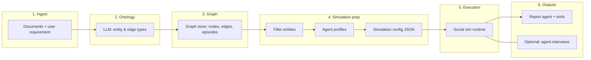

# Architecture: Policy-Oriented Social Simulation for Forecasting

This document describes the **logic and system architecture** of a multi-agent pipeline for **policy-relevant scenario forecasting** (e.g. public reaction, narrative spread, stakeholder dynamics). It is written so another implementer or AI can **reproduce the system in a new repository** without relying on any product-specific naming.

The framing below uses **Singapore** as an example jurisdiction: adjust seed corpora, ontology prompts, timezones, and entity types to match your domain.

---

## 1. Purpose and scope

### 1.1 What the system does

1. **Ingest** seed documents (policy drafts, parliamentary materials, news, briefs, consultation papers, stakeholder analyses).
2. **Extract** a structured **ontology** (entity and relation types) suited to *social actors* who can plausibly post, comment, or influence discourse online.
3. **Build** a **knowledge graph** over the text so entities and relationships are queryable.
4. **Instantiate** each graph entity as a **social agent** with a rich persona (bio, interests, stance, behaviour parameters).
5. **Configure** a discrete-time **social simulation** (timeline, events, per-agent activity, platform parameters).
6. **Run** agents inside a **social environment** where they choose actions (post, comment, like, etc.) using LLM reasoning.
7. **Produce** narrative and analytic **reports** grounded in graph retrieval and (optionally) live **interviews** with running agents.

This is **not** a formal reinforcement-learning “policy” (π). The word *policy* here means **real-world government or organisational policy** and the **decisions** analysts want to stress-test in a sandbox.

### 1.2 What it does not guarantee

- Causal identification with real populations.
- Calibration to empirical vote shares or survey margins unless you add your own data layer.
- Legal or regulatory advice.

Treat outputs as **structured thought experiments** and communication aids, not predictions of real outcomes.

---

## 2. High-level pipeline



**Control flow (typical):**

| Phase | Responsibility |
|-------|----------------|
| A | Parse uploads; chunk text; optional async **graph build** job |
| B | LLM generates **ontology** JSON (entity types, edge types, constraints) |
| C | Push text chunks + ontology to **graph API**; poll until graph is ready |
| D | Read nodes/edges; **filter** to “simulation-relevant” entity types |
| E | For each entity, generate **OASIS-style agent profile** (CSV for microblog-style platform, JSON for forum-style) |
| F | LLM generates **simulation_config.json** (time, events, per-agent activity, stance, platform weights) |
| G | Subprocess runs **preset Python scripts** that call the social sim library |
| H | **Report agent** uses retrieval tools over the graph + logs; optional **IPC** sends interview prompts to the live sim |

---

## 3. Core components (implement as services/modules)

### 3.1 Text processor

- **Input:** Raw text, file paths, or extracted PDF/markdown.
- **Output:** Normalised text, chunks with overlap (e.g. 500 tokens/chars with 50 overlap—tune to your graph provider).
- **Notes:** Keep encoding explicit (UTF-8). Large PDFs may need a dedicated extractor.

### 3.2 Ontology generator (LLM)

- **Input:** Full or truncated document text + **simulation requirement** string (what the user wants to learn).
- **Output:** JSON with:
  - `entity_types`: named types, descriptions, optional attributes, examples.
  - `edge_types`: directed relation names, valid (source, target) pairs.
  - `analysis_summary`: short rationale.

**Design rule:** Entity types must represent **actors** that can participate in online discourse (persons, agencies, firms, media, unions, NGOs), not abstract nouns (“inflation”, “trust”) as graph nodes.

**Reference pattern:** Fix the **number** of types (e.g. exactly 10 types) and require **two generic fallbacks** (e.g. `Person`, `Organization`) so extraction never leaves orphan nodes without a label.

**Singapore example:** Types might include `GovernmentAgency`, `StatutoryBoard`, `MP`, `IndustryAssociation`, `LocalMedia`, `CitizenGroup`, plus `Person` and `Organization` as fallbacks—always derived from *your* corpus, not hard-coded globally.

### 3.3 Graph builder service

- **Input:** Chunked text, ontology, graph name/metadata.
- **Output:** `graph_id`, node/edge counts, entity type list.

**Implementation note:** One common approach is a **hosted graph API** (e.g. Zep Cloud) that accepts episodic ingestion and builds a standalone graph. Your service should:

- Batch chunks (rate limits).
- Poll task status if the API is asynchronous.
- Expose **read** helpers: list nodes with labels, list edges, fetch node by id.

**Abstraction:** Code against an interface `GraphStore` so you can swap Zep for Neo4j, Memgraph, or a local RDF store later.

### 3.4 Entity reader and filter

- **Input:** `graph_id`, optional list of allowed entity type names.
- **Output:** List of `EntityNode` objects with optional neighbourhood context (edges, related nodes).

**Filtering logic:** Exclude generic “Entity”-only nodes; only include nodes whose labels match **defined** ontology types. This keeps the sim from spawning agents for noise.

### 3.5 Agent profile generator

- **Input:** Filtered entities; optional **graph-backed retrieval** per entity for richer bios; `use_llm` flag.
- **Output:**
  - **Microblog platform:** CSV with required columns expected by the sim library (username, bio, etc.).
  - **Forum platform:** JSON list of profile dicts; **must** include stable `user_id` matching the runtime agent graph.

**Behaviour:** For each entity, map graph fields → persona fields (name, description, topics, political/sentiment hints). LLM can expand short graph nodes into posting style and interests.

**Parallelism:** Batch LLM calls with a concurrency limit to avoid rate limits.

### 3.6 Simulation config generator (LLM, multi-step)

Avoid one giant JSON from a single call. **Split steps:**

1. **Time config:** Total simulated hours, minutes per round, peak/off-peak hours, activity multipliers.
2. **Event config:** Initial posts, scheduled events, hot keywords, optional “narrative direction” string.
3. **Agent batches:** For each agent (or batches of ~15), activity level, posts/comments per hour, active hours, sentiment bias, **stance** (supportive / opposing / neutral / observer), influence weight, response delay range.
4. **Platform config:** Recency vs popularity vs relevance weights; echo-chamber strength; viral threshold—per platform if dual.

**Output file:** `simulation_config.json` serialising a `SimulationParameters` structure (see section 5).

**Context limits:** Truncate document text per step; pass entity summaries rather than full graph for large projects.

### 3.7 Simulation manager (orchestration)

- **State machine:** `created → preparing → ready → running → completed | failed | stopped`.
- **Persistence:** Per-simulation directory under a configurable root; `state.json` for status and metadata.
- **Artifacts:** Profiles, `simulation_config.json`, logs; do not duplicate runner scripts if they live in a fixed `scripts/` package.

### 3.8 Simulation runner

- **Role:** Start a **subprocess** (not in-request thread) running the platform script with `--config` pointing at `simulation_config.json` and working directory = simulation folder.
- **Environment:** Inject `LLM_API_KEY`, `LLM_BASE_URL`, `LLM_MODEL` (or equivalent) for the child process.
- **Optional:** `max_rounds` cap; optional **graph memory writeback** (post-simulation or per-round updates to the graph store).

### 3.9 Social simulation runtime (external library)

The reference architecture uses **OASIS** (Open Agent Social Interaction Simulations) from the CAMEL-AI ecosystem: Python package `oasis-ai` with `camel-ai`. It provides:

- `oasis.make(...)` to create an environment for a given platform type (e.g. Twitter-like, Reddit-like).
- An **agent graph** built from profiles + LLM backend.
- A **step loop** advancing rounds; agents observe feeds and choose actions from an allowed action list.

**Your rebuild must pin versions** and isolate this in an adapter module so library upgrades do not scatter across the codebase.

### 3.10 Preset runner scripts (thin wrappers)

Three patterns:

| Script | Use case |
|--------|----------|
| Microblog-only | Single platform run |
| Forum-only | Single platform run |
| Parallel | Two platform envs in one process (or two processes if you split—match your IPC design) |

Each script should:

1. Load `simulation_config.json`.
2. Construct the LLM model from config (OpenAI-compatible API is typical).
3. Load profiles from CSV or JSON.
4. Build `agent_graph` via library helpers.
5. Call `oasis.make` with correct platform enum and action space.
6. Run rounds until completion or `max_rounds`.
7. Write **structured action logs** (for monitoring and reports).

### 3.11 IPC (optional but reference architecture includes it)

**Problem:** The web server process is not the same as the long-running sim process. **Interview** features (ask an agent a question mid-sim) need a channel.

**Pattern:** File-based IPC under the simulation directory:

- `commands/` — server drops JSON commands (e.g. `interview`, `batch_interview`, `close_env`).
- `responses/` — sim process writes results.

The runner script polls commands between rounds; the API enqueues commands and polls responses with timeouts.

### 3.12 Report agent

- **Pattern:** ReAct-style or planner + tools over:
  - Graph search / structured queries.
  - Optional “insight” or summarisation tools backed by the graph API.
  - Optional **interview tool** calling IPC when the sim is live.
- **Flow:** Plan sections → generate each section with tool use → optional reflection rounds → assemble final report (Markdown/HTML).
- **Logging:** Append-only JSONL of tool calls and LLM steps for auditability.

### 3.13 HTTP API (backend)

Typical route groups:

- Graph: build status, fetch graph stats.
- Entities: list/filter/detail by type.
- Simulation: create, prepare, start, stop, status, list.
- Reports: create, stream progress, download.

Use a single backend framework (e.g. Flask/FastAPI) and a thin **frontend** for uploads and dashboards if needed.

---

## 4. Configuration surface (environment variables)

| Variable | Role |
|----------|------|
| `LLM_API_KEY` / `LLM_BASE_URL` / `LLM_MODEL_NAME` | All LLM calls (ontology, profiles, sim config, report, OASIS agents). |
| `ZEP_API_KEY` (or your graph provider) | Graph build and retrieval. |
| `OASIS_DEFAULT_MAX_ROUNDS` | Safety cap for long runs. |
| `REPORT_AGENT_*` | Tool-call limits, temperature, reflection depth. |

Secrets never belong in the repository; use `.env` locally and a secrets manager in production.

---

## 5. Canonical artefacts (per simulation)

```
uploads/simulations/{simulation_id}/
  state.json                 # status, counts, errors
  simulation_config.json     # full SimulationParameters
  twitter_profiles.csv         # if microblog enabled
  reddit_profiles.json         # if forum enabled
  log/                         # env and action logs
  commands/ / responses/       # if IPC enabled
```

**`simulation_config.json` conceptual schema:**

- **Identifiers:** `simulation_id`, `project_id`, `graph_id`, `simulation_requirement` (user goal text).
- **`time_config`:** duration, granularity, circadian multipliers (see below).
- **`agent_configs[]`:** per-agent behavioural parameters + stance.
- **`event_config`:** seeds and schedules for narrative kickoff.
- **`twitter_config` / `reddit_config`:** feed algorithm knobs.
- **`llm_model`, `llm_base_url`:** passed into the runner.
- **`generation_reasoning`:** optional trace from the config LLM.

---

## 6. Time model and “circadian” activity

The reference implementation uses **hour-of-day multipliers** to mimic human activity patterns (e.g. dead hours at night, peak in evening). For **Singapore**, you should:

- Set timezone to **Asia/Singapore** (UTC+8).
- Replace or reweight hours if you simulate **institutional** actors (agencies posting in office hours) vs **general public** (evening peaks).

Encode this either in **prompt instructions** to the config LLM or in **default constants** in your config generator.

---

## 7. Action spaces (illustrative)

These are passed to the environment so the LLM policy inside each agent chooses among discrete actions:

**Microblog-style:** e.g. `CREATE_POST`, `LIKE_POST`, `REPOST`, `FOLLOW`, `QUOTE_POST`, `DO_NOTHING`.

**Forum-style:** e.g. `CREATE_POST`, `CREATE_COMMENT`, likes/dislikes, search, trend, refresh, follow, mute, `DO_NOTHING`.

Your adapter should **stay aligned** with the installed library version’s enum or string contracts.

---

## 8. Singapore-oriented tailoring (content and governance)

Use this checklist when adapting the **same architecture** to Singapore policy forecasting:

1. **Seed corpus:** Hansard excerpts, government press releases (e.g. `gov.sg`), consultation PDFs, mainstream and independent local outlets you have rights to use.
2. **Ontology prompts:** Explicitly allow entity types such as ministries, statutory boards, MPs, unions, trade associations, and community councils **when the text supports them**.
3. **Language:** English + Singlish or bilingual outputs only if your LLM and evaluation plan support it; otherwise keep prompts in formal English.
4. **Neutrality and harm:** Add system-level instructions to avoid defamation, to label outputs as simulated, and to avoid impersonating real individuals without clear fictionalisation.
5. **Calibration (optional extension):** Import survey marginals or polling data as **priors** or post-processing—this is **not** in the base architecture and would be a separate module.

---

## 9. Implementation order (greenfield repo)

1. **Config + LLM client** (OpenAI-compatible).
2. **Ontology generator** + JSON schema validation.
3. **Graph builder** + entity reader + filters.
4. **Profile generator** + file writers (CSV/JSON).
5. **Simulation config generator** (multi-step LLM).
6. **Simulation manager** + on-disk state.
7. **Runner subprocess** + one platform script end-to-end.
8. **Action logging** and minimal UI or CLI.
9. **IPC** if you need interviews.
10. **Report agent** + tools + export formats.

---

## 10. Dependencies (reference stack)

- **Backend:** Python 3.11+ (check compatibility with `oasis-ai` and `camel-ai`).
- **Social sim:** `oasis-ai`, `camel-ai` (see upstream docs for platform types and APIs).
- **Graph:** Provider SDK (e.g. Zep Cloud) or your `GraphStore` implementation.
- **LLM:** Any provider with an OpenAI-compatible chat completions API.
- **Frontend (optional):** Node.js 18+ for a SPA talking to your REST API.

Pin versions in `requirements.txt` or `uv.lock`.

---

## 11. Testing suggestions

- **Unit:** Ontology JSON validates; chunking preserves sentence boundaries where possible.
- **Integration:** Small graph (10 nodes) runs one round without LLM errors (use a cheap model).
- **Golden files:** Snapshot `simulation_config.json` shape for a fixed seed text (regressions on schema).
- **IPC:** Single interview command/response round-trip with a mock loop.

---

## 12. Open-source building blocks (names for search)

- **OASIS** — agent social simulation runtime (CAMEL-AI).
- **Zep** — cloud graph memory (if you keep the same graph backend); otherwise replace with your chosen store.

This document intentionally does **not** name any commercial product built on top of this pattern; it describes **reusable architecture** only.

---

## Document history

- Authoring intent: enable a clean-room rebuild for **personal policy-forecasting experiments** with a **Singapore** focus, using the same structural ideas as the reference codebase this file was derived from.
